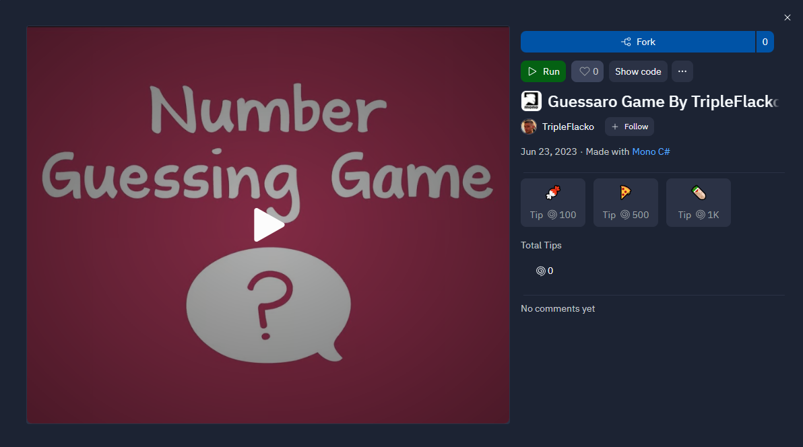

# Guessaro-Game-By-TripleFlacko

A simple Guess A Number game created by TripleFlacko 

<a href="https://replit.com/@TripleFlacko/Guessaro-Game-By-TripleFlacko">Guessaro</a> is a simple **Guess A Number game**, where you need to guess a number **from 1 to 100** by typing in the number. Each time you enter the number, the computer will tell you whether it is **lower** or **higher** than the **expected** number. You will have **10 tries** to guess.

You will win the game once your number matches computer's number.

## Input and Output

Choose a **number** between `1` and `100`, then press `Enter`.

The computer selects a **random number**, then returns information whether the number is **less than**, **great than**, or **equal** to the selected number and the number of tries you have left.

Once you have either correctly guessed the number or exhausted your attempts, you will be prompted to indicate whether you wish to play again. To initiate another round, press `y`, to exit the game, press `n`.

## Solution

<table>
  <tr>
    <th>You</th>
    <th>Computer</th>
    <th>Outcome</th>
  </tr>
  <tr>
    <td>50</td>
    <td>80</td>
    <td>Too Low! You have 9 tries left.</td>
  </tr>
  <tr>
    <td>85</td>
    <td>80</td>
    <td>Too High! You have 8 tries left.</td>
  </tr>
    <tr>
    <td>80</td>
    <td>80</td>
    <td>Congratulations! You guessed it!</td>
</table>

We handle all these situations using a series of checks.

After you guessed the number or ran out of tries, you will asked if you want to play again. Press `y` to play again or `n` to quit the game.

## Source Code

[Click here to open the file](Guessaro-Game-By-TripleFlacko.cs)

## Screenshots

## Live Demo

You can play the game directly in your Web browser <a href="https://replit.com/@TripleFlacko/Guessaro-Game-By-TripleFlacko">here</a>:

  

